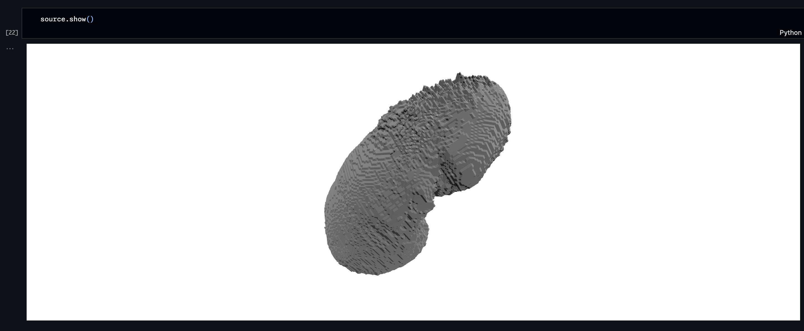

# HRA-AMAP Assessment

## Overview
This repository contains my assessment submission for the HRA-AMAP project. It includes Jupyter Notebooks showcasing the execution of key functionalities from the AMAP GitHub repository.

## Setup and Execution

### 1. Downloading GLB Model Files
I downloaded the following 3D models from [Human Atlas](https://humanatlas.io/3d-reference-library?version=2.2&organ=All%20Organs):
- **Male Left Kidney**
- **Male Right Kidney**

### 2. Setting up the AMAP Repository
I cloned the official [AMAP GitHub repository](https://github.com/cns-iu/hra-amap) and installed the necessary dependencies following the instructions provided.

### 3. Running Jupyter Notebooks
The following notebooks were executed successfully, and the results are included:
- [`Usage.ipynb`](notebooks/Usage.ipynb)
- [`Bidirectional Projections.ipynb`](notebooks/Bidirectional%20Projections.ipynb)
- [`Registration Error Visualization.ipynb`](notebooks/Registration%20Error%20Visualization.ipynb)

### 4. Source for Kidney Projections
The **Vanderbilt Generic** dataset was used as the source for the kidney projections.

## Visualizations
Usage Notebook - Source

Usage Notebook - Target

Usage Notebook - Registration

Bidirectional - Forward

Bidirectional - Backward

Registration Error Visualization - Point Cloud Before

Registration Error Visualization - Point Cloud After

Registration Error Visualization - Heatmap

Registration Error Visualization - Histogram

## Issues Faced
No issues were encountered while setting up or running the code.

## Optimizations Suggested
- **Path Management:** The current implementation uses absolute paths in several places, which can cause issues across different environments. Replacing them with relative paths would improve portability and ease of use.

## Submission
The modified notebooks containing execution results are available in this repository. The GitHub link to this repository is included in the application email.